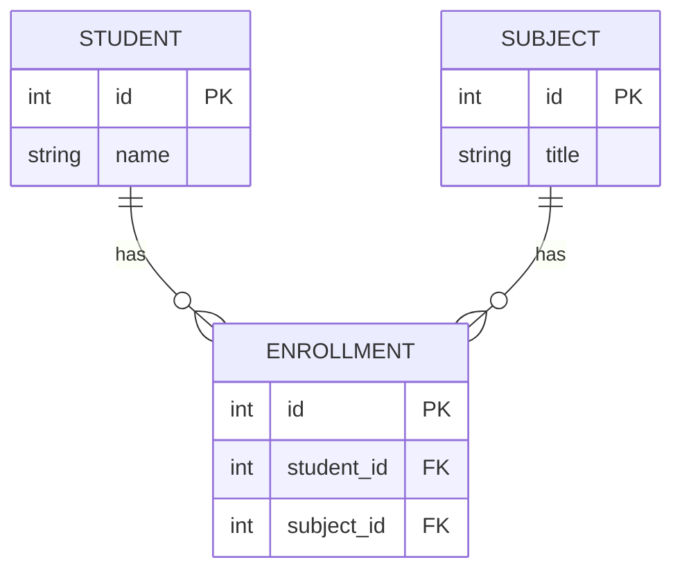
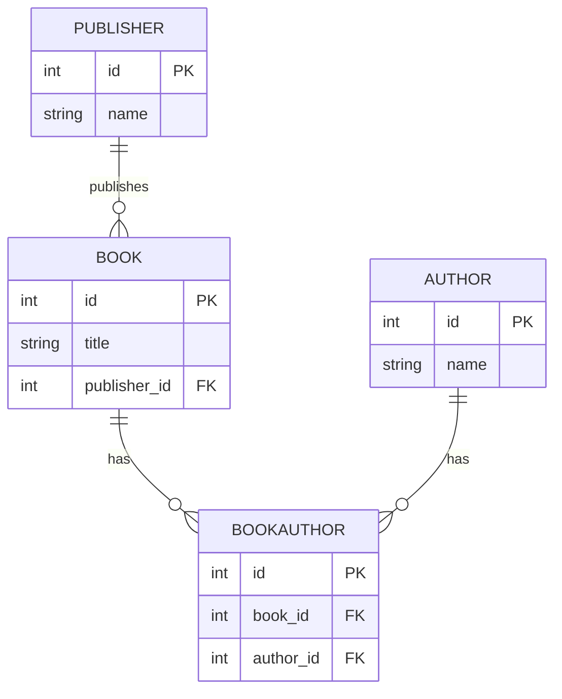
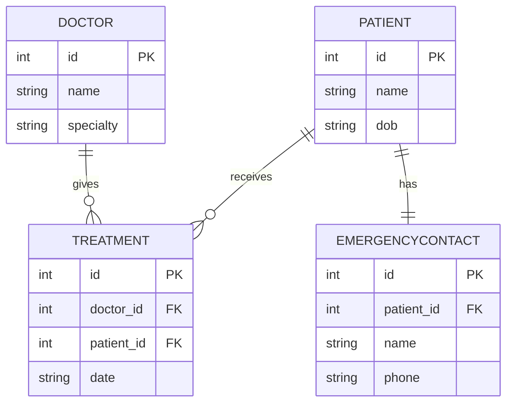

# E-R Modelling

This document tracks my learning journey on **Entity-Relationship (E-R) Modelling** — going from system analysis to logical modelling, and eventually to physical database design with PostgreSQL + Prisma ORM, covering keys, normalization, indexing, ACID, and joins along the way.

---

## Why System Analysis Before Modelling

Before drawing a single table, real-world requirements need to be gathered and read carefully — this is **system analysis**. For example: *"An institution has students who enroll in multiple subjects."* This one sentence hides all the information needed to design the database — but only if it's analyzed properly for entities, attributes, and relationship cardinality.

The process professionals follow is:

1. **System Analysis** — understand the real-world problem in plain language.
2. **Logical (Conceptual) Modelling** — identify entities, attributes, and relationships. Technology-agnostic — no database, no data types yet. This is where **E-R diagrams** and **crow's foot notation** live.
3. **Physical Modelling** — convert the logical model into actual database tables, columns, data types, and constraints (in our case, a PostgreSQL schema written using Prisma).

Skipping straight to physical modelling (i.e., jumping into writing tables) without this analysis is the most common reason beginner database designs end up with duplicate data, broken relationships, or missing junction tables.

---

## Thinking in Entities

### Entities vs Attributes

An **entity** is a real-world "thing" that needs its own identity and records (e.g., `Student`, `Subject`, `Doctor`).

An **attribute** is a property that describes an entity (e.g., `name`, `age`, `email`).

### Types of Attributes

| Type | Meaning | Example |
|---|---|---|
| Simple | Atomic, can't be broken down further | `age` |
| Composite | Can be split into smaller parts | `full_name` → `first_name` + `last_name` |
| Derived | Can be calculated from other stored data — usually shouldn't be stored | `age` (when `date_of_birth` is already stored) |

### Primary Keys:

- **Natural key** — something that already exists in real life and is unique (e.g., email, national ID).
- **Surrogate key** — an artificial ID generated purely for uniqueness (e.g., auto-increment integer, UUID).

---

## Relationship Types & Crow's Foot Notation

### The Three Relationship Types

| Relationship | Meaning | Example |
|---|---|---|
| **One-to-One (1:1)** | One instance of A relates to exactly one instance of B | `Patient` ↔ `EmergencyContact` |
| **One-to-Many (1:N)** | One instance of A relates to many instances of B, but each B belongs to only one A | `Publisher` → `Book` |
| **Many-to-Many (M:N)** | Many instances of A relate to many instances of B, and vice versa | `Student` ↔ `Subject` |

### Crow's Foot Notation Symbols

Crow's foot notation is the industry-standard way to draw E-R diagrams. Each end of a relationship line has a symbol describing cardinality:

| Symbol | Meaning |
|---|---|
| `\|\|` | Exactly one |
| `o\|` | Zero or one |
| `\|{` | One or many |
| `o{` | Zero or many |

### Example 1: Student ↔ Subject (Many-to-Many)

A relational database column can only hold one value per row — so true M:N relationships can't be modeled directly. The solution is a **junction table** (also called a join/associative/linking table) that breaks one M:N relationship into two 1:N relationships.

**Reading it:** One Student relates to zero-or-many Enrollments. One Subject relates to zero-or-many Enrollments. Each Enrollment row represents one specific "this student takes this subject" fact.

A junction table doesn't represent a "thing" the way Student or Subject does — it represents the **fact that a connection exists** between two entities. Junction tables can also carry their own attributes about the relationship (e.g., `enrollment_date`, `grade`).

### Example 2: Bookstore (1:N + M:N combined)

Scenario: *A publisher publishes many books (1:N). A book can have multiple authors, and an author can write multiple books (M:N).*

**Key observation:** `Publisher → Book` is a direct 1:N — no junction table needed, the FK just sits on `Book`. `Book ↔ Author` is M:N — it needs the `BookAuthor` junction table.

### Example 3: Hospital (M:N + 1:1 combined)

Scenario: *A doctor treats many patients, and a patient can be treated by many doctors (M:N). Each patient has exactly one primary emergency contact (1:1).*

**Key observation:** `Doctor ↔ Patient` needs a junction table (`Treatment`) — think of it as a logbook: every time a doctor treats a patient, one new row is added. `Patient ↔ EmergencyContact` is 1:1 — both ends show `||` (single line, no fork), and no junction table is needed; the FK just sits on the "dependent" entity (`EmergencyContact`, since it only makes sense in the context of a patient).

### Key Rule: FK Always Goes on the "Many" Side

For a 1:N relationship, the foreign key always lives on the table representing the "many" side, pointing back to the "one" side's primary key.

For an M:N relationship, since neither side can hold a single FK to represent "many," a junction table is introduced — and it holds foreign keys to **both** original entities, effectively turning one M:N relationship into two 1:N relationships.

For a 1:1 relationship, the foreign key goes on whichever entity is more "dependent" on the other for its existence, and is marked as **unique** to enforce the one-to-one constraint (covered further in Module 3, once we translate this into Prisma schema).

---

*More modules coming soon: Prisma schema translation, normalization (1NF–3NF), indexing, ACID & transactions, and joins.*