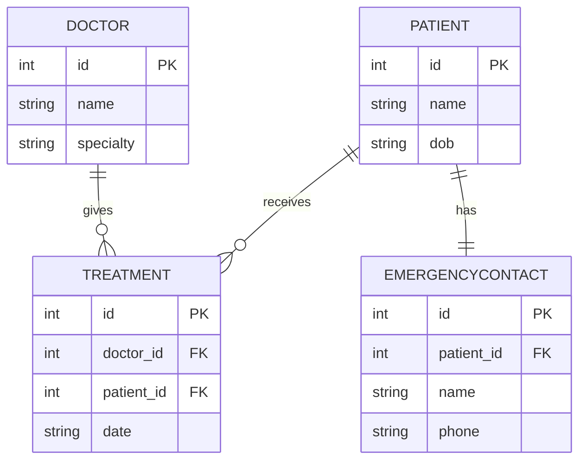

# E-R Modelling

Notes and examples from learning database design — from system analysis to E-R diagrams to Prisma schema. Tech stack: PostgreSQL + Prisma.

---

## Why System Analysis First

Before designing tables, requirements need to be read carefully to find entities, attributes, and how they relate — this is **system analysis**. It's followed by **logical modelling** (E-R diagrams, tech-agnostic) and then **physical modelling** (actual database schema). Skipping straight to tables is how you end up missing junction tables or breaking relationships.

## Crow's Foot Notation

| Symbol | Meaning |
|---|---|
| `\|\|` | Exactly one |
| `o\|` | Zero or one |
| `\|{` | One or many |
| `o{` | Zero or many |

## Relationship Types

- **1:1** — e.g. Patient ↔ EmergencyContact
- **1:N** — e.g. Publisher → Book
- **M:N** — e.g. Student ↔ Subject (needs a junction table, since a column can only hold one FK value)

## Reading a Table (Entity Box)

Each box in a diagram = one table. Inside it:

- **PK (Primary Key)** — the column that uniquely identifies each row, like a fingerprint. No two rows share the same PK.
- **FK (Foreign Key)** — a column that stores another table's PK, used to link two tables together.
- Every other field is just a regular attribute (name, date, phone, etc).

For example, in `TREATMENT` below, `doctor_id` and `patient_id` are both FKs — they're what tie one Doctor and one Patient together for that specific record.

### Example: Hospital System

**Problem statement:** *A hospital has doctors. Each doctor can treat many patients, and each patient can be treated by many doctors over time. Each patient has exactly one primary emergency contact person.*

From this: Doctor↔Patient is M:N (both sides say "many"), and Patient↔EmergencyContact is 1:1 (both sides say "one").



Doctor ↔ Patient is M:N, resolved with the `Treatment` junction table. Patient ↔ EmergencyContact is 1:1, so the FK just sits on `EmergencyContact` with a unique constraint — no junction table needed.

## Prisma Translation

Each entity box becomes a `model`. Each FK becomes a scalar field + a `@relation`. Here's how the hospital diagram maps over, piece by piece:

**Doctor & Patient** — plain entities to start, plus a `Treatment[]` field. That array isn't a real column; it just lets Prisma fetch `doctor.treatments` in code.

```prisma
model Doctor {
  id         Int         @id @default(autoincrement())
  name       String
  specialty  String
  treatments Treatment[]
}

model Patient {
  id               Int               @id @default(autoincrement())
  name             String
  dob              DateTime
  treatments       Treatment[]
  emergencyContact EmergencyContact?
}
```

**Treatment** — the junction table for the M:N. It holds two FKs, one to each side. This is what turns "many doctors ↔ many patients" into two ordinary 1:N relationships.

```prisma
model Treatment {
  id        Int      @id @default(autoincrement())
  date      DateTime
  doctorId  Int
  doctor    Doctor   @relation(fields: [doctorId], references: [id])
  patientId Int
  patient   Patient  @relation(fields: [patientId], references: [id])
}
```

**EmergencyContact** — the 1:1 side. Same FK pattern as above, but `patientId` is marked `@unique`, which is the one thing stopping a patient from having more than one contact.

```prisma
model EmergencyContact {
  id        Int     @id @default(autoincrement())
  name      String
  phone     String
  patientId Int     @unique
  patient   Patient @relation(fields: [patientId], references: [id])
}
```

**Key takeaway:** M:N → separate junction model with two FKs. 1:1 → FK on the dependent model with `@unique`. 1:N → FK on the "many" model, no `@unique`.

---

*Next: normalization, indexing, ACID, joins.*